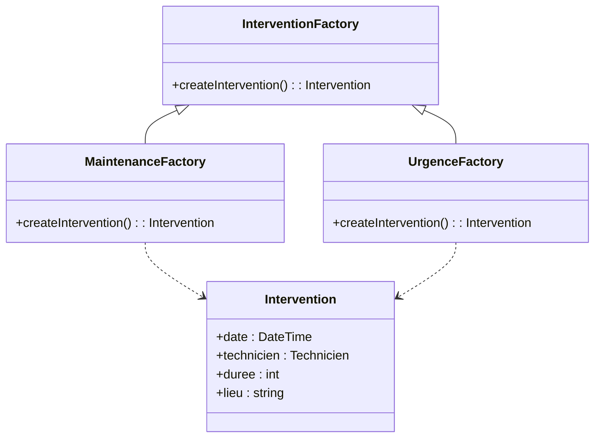
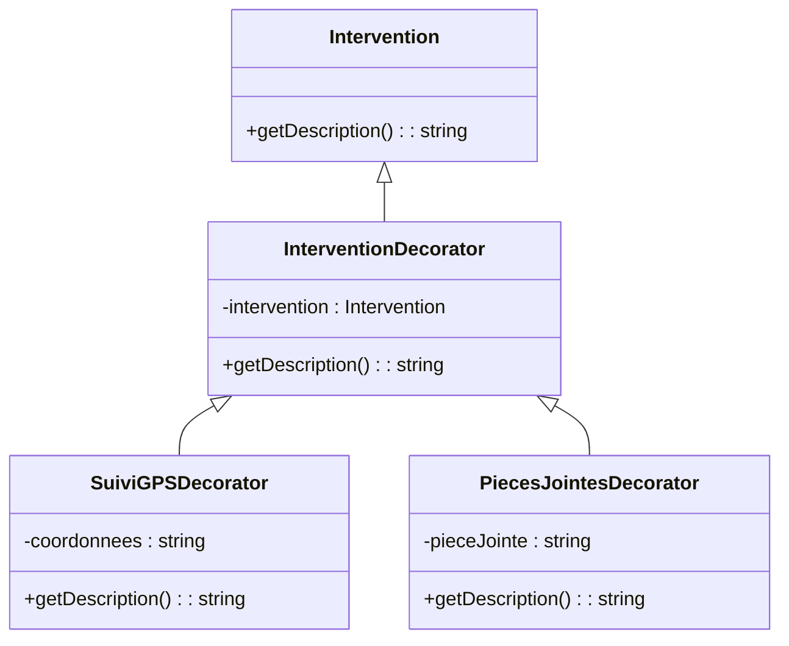
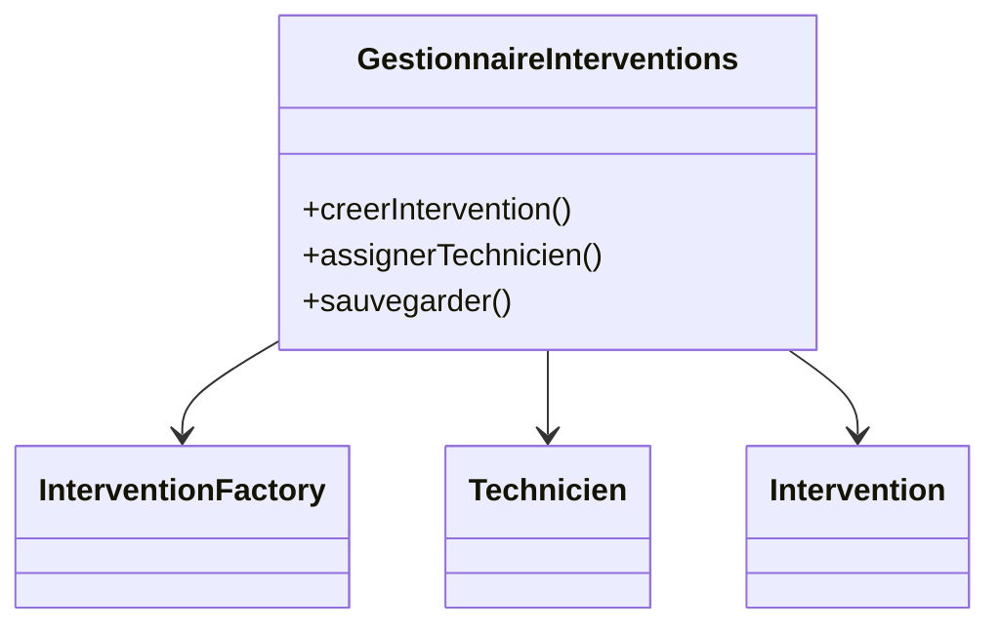
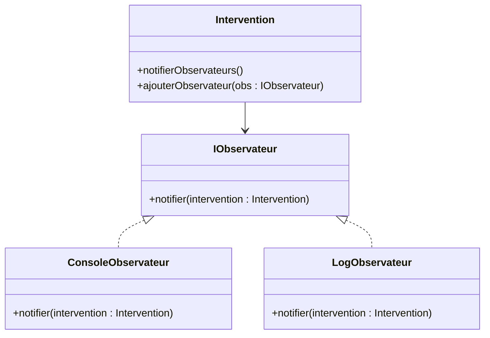
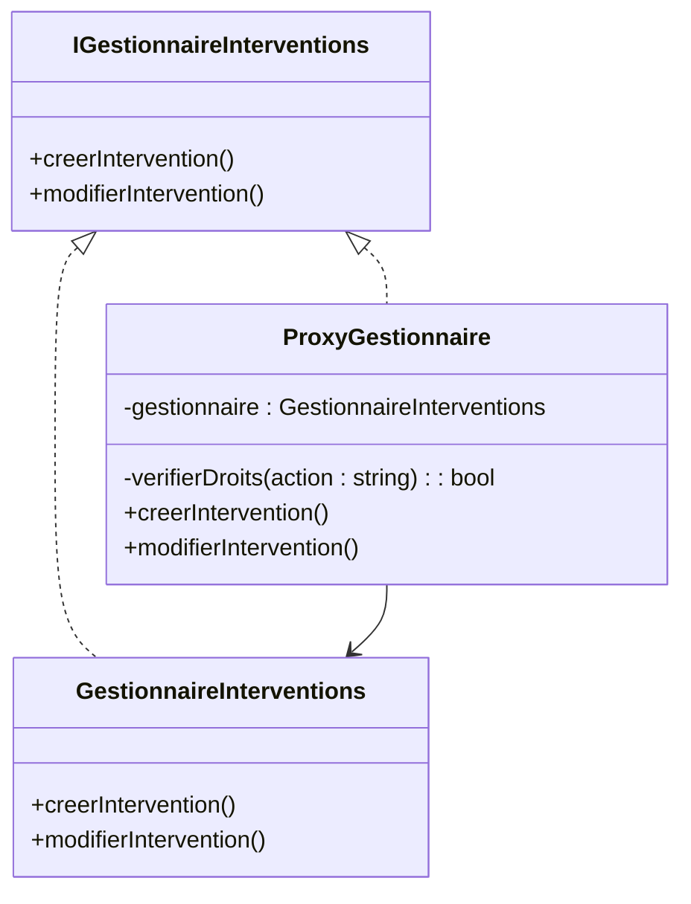

# Diagrammes UML du Projet

## 1. Pattern Factory Method

```mermaid
classDiagram
    class InterventionFactory {
        +createIntervention() : Intervention
    }
    class MaintenanceFactory {
        +createIntervention() : Intervention
    }
    class UrgenceFactory {
        +createIntervention() : Intervention
    }
    class Intervention {
        +date : DateTime
        +technicien : Technicien
        +duree : int
        +lieu : string
    }
    InterventionFactory <|-- MaintenanceFactory
    InterventionFactory <|-- UrgenceFactory
    MaintenanceFactory ..> Intervention
    UrgenceFactory ..> Intervention
```

## 2. Pattern Decorator

```mermaid
classDiagram
    class Intervention {
        +getDescription() : string
    }
    class InterventionDecorator {
        -intervention : Intervention
        +getDescription() : string
    }
    class SuiviGPSDecorator {
        -coordonnees : string
        +getDescription() : string
    }
    class PiecesJointesDecorator {
        -pieceJointe : string
        +getDescription() : string
    }
    Intervention <|-- InterventionDecorator
    InterventionDecorator <|-- SuiviGPSDecorator
    InterventionDecorator <|-- PiecesJointesDecorator
```

## 3. Pattern Facade

```mermaid
classDiagram
    class GestionnaireInterventions {
        +creerIntervention()
        +assignerTechnicien()
        +sauvegarder()
    }
    class InterventionFactory
    class Technicien
    class Intervention
    GestionnaireInterventions --> InterventionFactory
    GestionnaireInterventions --> Technicien
    GestionnaireInterventions --> Intervention
```

## 4. Pattern Observer

```mermaid
classDiagram
    class IObservateur {
        +notifier(intervention : Intervention)
    }
    class Intervention {
        +notifierObservateurs()
        +ajouterObservateur(obs : IObservateur)
    }
    class ConsoleObservateur {
        +notifier(intervention : Intervention)
    }
    class LogObservateur {
        +notifier(intervention : Intervention)
    }
    IObservateur <|.. ConsoleObservateur
    IObservateur <|.. LogObservateur
    Intervention --> IObservateur
```

## 5. Pattern Proxy

```mermaid
classDiagram
    class IGestionnaireInterventions {
        +creerIntervention()
        +modifierIntervention()
    }
    class GestionnaireInterventions {
        +creerIntervention()
        +modifierIntervention()
    }
    class ProxyGestionnaire {
        -gestionnaire : GestionnaireInterventions
        -verifierDroits(action : string) : bool
        +creerIntervention()
        +modifierIntervention()
    }
    IGestionnaireInterventions <|.. GestionnaireInterventions
    IGestionnaireInterventions <|.. ProxyGestionnaire
    ProxyGestionnaire --> GestionnaireInterventions
``` 